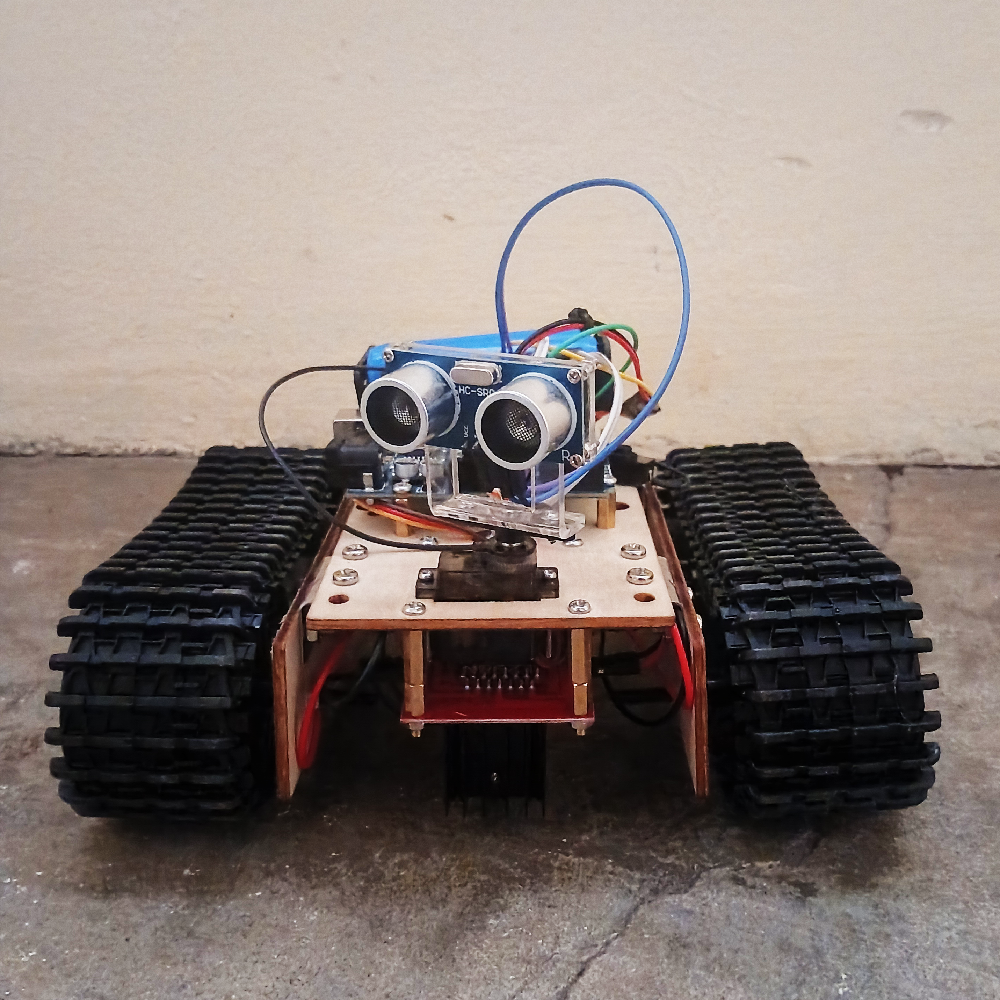

  

  

  

  
  

---

# IDA-Robot-v00
## INTEGRATED DRIVE AUTOMATON
### A DREAM Robotics Agent

- Robot Type: Tank

---

### Software
- [Arduino IDE](https://docs.arduino.cc/software/ide/)

---

## Related Projects (DREAM Robotics Ecosystem)

- [WHIP-Robot-v00](https://github.com/CursedPrograms/WHIP-Robot-v00)
- [KIDA-Robot-v00](https://github.com/CursedPrograms/KIDA-Robot-v00)
- [KIDA-Robot-v01](https://github.com/CursedPrograms/KIDA-Robot-v01)
- [NORA-Robot-v00](https://github.com/CursedPrograms/NORA-Robot-v00)
- [MILA-Robot-v01](https://github.com/CursedPrograms/MILA-Robot-v01)
- [ARM-Robot-v01](https://github.com/CursedPrograms/ARM-Robot-v01)
- [RIFT](https://github.com/CursedPrograms/RIFT)
- [DREAM](https://github.com/CursedPrograms/DREAM)

---

## Hardware

- Small Wooden Tank Robot Chassis
- Arduino
- 2S 18650
- L298N
- MG95 Servo
- Ultrasonic Sensor
- 5V DC Motors
- IR Receiver

---

 

© Cursed Entertainment 2026

 

  

 

  

