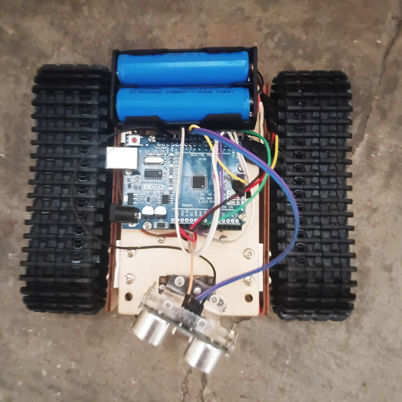

  

  

  

  
  

---

# IDA-Robot-v00
## INTEGRATED DRIVE AUTOMATON
### A DREAM Robotics Agent

- Robot Type: Tank

  
  
<i>IDA</i>

  
  

---

### Software
- [Arduino IDE](https://docs.arduino.cc/software/ide/)
- Libraries: `Servo` (bundled with the IDE) and [`IRremote`](https://github.com/Arduino-IRremote/Arduino-IRremote) v4+ (install from the Library Manager)

---

## Related Projects (DREAM Robotics Ecosystem)

- [WHIP-Robot-v00](https://github.com/CursedPrograms/WHIP-Robot-v00)
- [KIDA-Robot-v00](https://github.com/CursedPrograms/KIDA-Robot-v00)
- [KIDA-Robot-v01](https://github.com/CursedPrograms/KIDA-Robot-v01)
- [NORA-Robot-v00](https://github.com/CursedPrograms/NORA-Robot-v00)
- [MILA-Robot-v00](https://github.com/CursedPrograms/MILA-Robot-v00)
- [ARM-Robot-v01](https://github.com/CursedPrograms/ARM-Robot-v01)
- [RIFT](https://github.com/CursedPrograms/RIFT)
- [DREAM](https://github.com/CursedPrograms/DREAM)

---

## Overview

IDA is MILA's little sibling: the same tank chassis cut down to a plain Arduino, an ultrasonic sensor on a servo, an IR receiver and an L298N. There is no WiFi or Bluetooth. Everything is driven from an IR remote, or by [NORA](https://github.com/CursedPrograms/NORA-Robot-v00) over the IR link below.

- **Drive modes:** OBSTACLE (autonomous, the default at boot), WASD (car-style) and TANK (independent tracks).
- **Obstacle avoidance:** while driving, the sensor sweeps ahead and to both diagonals so walls met at an angle are caught too. When something is within 35 cm ahead or on a diagonal, IDA stops, backs up a little so the tracks have room to pivot, looks left and right and turns towards the more open side. The turn is a random size based on how much room there is: about 45–90° into open space, up to a full 180° when boxed in.
- **Buzzer:** a high beep at power-up and a low beep whenever she stops for an obstacle or the collision guard trips.
- **Safety:** in WASD and TANK modes a collision guard force-stops the robot if something gets within 15 cm while it is driving forward. In WASD mode it also stops as soon as you let go of the arrow key.
- **Speed:** cycle 100 / 75 / 50 / 25 % with the OK button.
- **Serial output:** distances, turns, mode changes and every IR code are printed on the Serial Monitor at 115200 baud.

---

## Hardware

- Small Wooden Tank Robot Chassis
- Arduino Uno (or Nano)
- 2S 18650
- L298N
- MG95 Servo
- HC-SR04 Ultrasonic Sensor
- 5V DC Motors
- IR Receiver + IR Remote (the same remote as MILA)
- Buzzer

---

## Controls (IR remote)

| Button | |
|---|---|
| `1` | OBSTACLE mode: drives itself and avoids obstacles |
| `2` | WASD mode: hold an arrow to drive, release to stop |
| `3` | TANK mode: each colour button switches one track on or off |
| `OK` | Cycle speed 100 / 75 / 50 / 25 % |

**TANK mode buttons**

| Button | Track |
|---|---|
| RED | Left forward |
| GREEN | Left backward |
| YELLOW | Right forward |
| BLUE | Right backward |

RED + YELLOW drives straight ahead. Press a button again to switch that track off. The receiver can only read one button at a time, so the tracks latch on and off instead of needing to be held.

### IDA link (driven by NORA)

NORA can drive IDA through her IR transmitter, from NORA's web page, Python controller or Bluetooth link. The link uses its own protocol so nothing else in the fleet reacts to it: **Samsung-format IR (38 kHz), address `0x0DA1`**, with command codes no fleet remote uses.

| Code | Command |
|---|---|
| `0x48` | Forward |
| `0x49` | Backward |
| `0x4A` | Left |
| `0x4B` | Right |
| `0x4C` | Stop (also leaves OBSTACLE mode) |
| `0x4D` | OBSTACLE mode |
| `0x4E` | WASD mode |
| `0x4F` | Cycle speed |

A drive command switches IDA into WASD mode by itself. NORA re-sends it every 150 ms while the button is held, and IDA stops once the link has been quiet for 500 ms. Link frames print on the Serial Monitor as `LINK:0x..`.

### Talking with NORA
NORA also chats with IDA over the link (`0x40` hello, `0x41` how are you, `0x42` happy, `0x43` curious, `0x44` sleepy, `0x45` let's play, `0x46` bye, `0x47` "I am here" beacon (silent)). IDA answers each phrase with her own buzzer melody, higher and quicker than NORA's, and prints `TALK:<phrase>` on the Serial Monitor. When NORA's beacon comes back after a minute of silence, IDA greets her (`TALK:NORA is back`). While she's driving (including OBSTACLE mode) she only gives a 40 ms chirp, so answering never holds up the obstacle checks.

> [!TIP]
> Using a different remote? Press its buttons with the Serial Monitor open: each one prints as `IR:0x..`. Copy those codes into the `IR_...` defines at the top of `IDA.ino`.

---

## ⚡ Pinout

<b>Arduino pin assignments</b>

### Sensors, Servo & Buzzer

| Signal | Pin |
|---|---|
| TRIG | 8 |
| ECHO | 9 |
| Servo | 10 |
| IR Receiver | 11 |
| Buzzer | A0 |

### L298N

| Signal | Pin | |
|---|---|---|
| ENA | 5 (PWM) | Right motor speed |
| IN1 | 2 | Right motor |
| IN2 | 3 | Right motor |
| ENB | 6 (PWM) | Left motor speed |
| IN3 | 4 | Left motor |
| IN4 | 7 | Left motor |

> [!IMPORTANT]
> Remove the ENA / ENB jumpers on the L298N, otherwise the speed setting does nothing. Pins 5 and 6 are the only PWM pins left free: the Servo library uses Timer1 (pins 9/10) and IRremote uses Timer2 (pins 3/11).

---

## Quick start

1. Install the `IRremote` library from the Arduino IDE Library Manager.
2. **Check the motors first:** upload `scripts/motor_test/motor_test.ino`. It repeats forward, backward, left and right for 1.5 s each and prints each step on the Serial Monitor. If a track spins the wrong way, swap that motor's two wires on the L298N (OUT1/OUT2 or OUT3/OUT4) instead of changing the code.
3. Upload `scripts/IDA/IDA.ino`. On power-up the servo sweeps left and right, then IDA starts in OBSTACLE mode.
4. Press `2` or `3` on the remote to take over.

### Tuning

These values are at the top of `IDA.ino`. Edit them and re-upload over USB.

| Setting | Default | |
|---|---|---|
| `turnTime` | 550 ms | About a 180° pivot. Obstacle turns are a random 1/4 to all of this. Increase if her 180 falls short |
| `stopDist` | 35 cm | How close an obstacle straight ahead gets before IDA stops and scans |
| `diagStopDist` | 35 cm | The same, for the diagonal looks |
| `backupTime` | 250 ms | How long IDA reverses before scanning (0 turns it off) |
| `guardDist` | 15 cm | How close an obstacle gets before the guard stops a manual drive |

 

© Cursed Entertainment 2026

 

  

 

  

